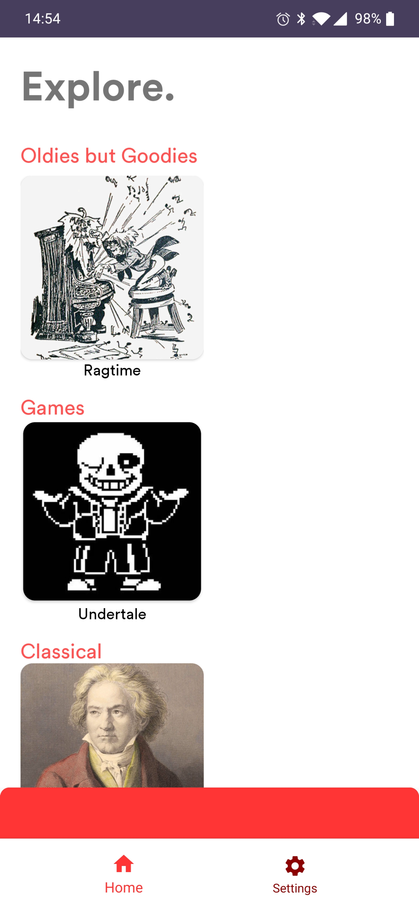
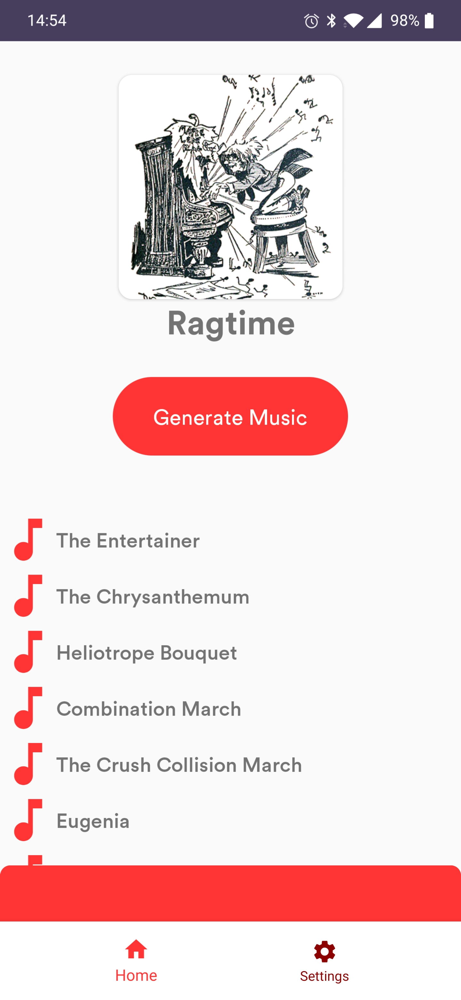
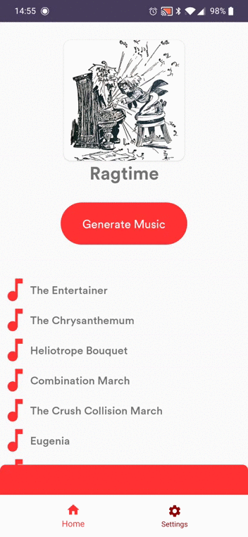

# Musinity

Deep learning generates music.  
  
Musinity is an app that generates music based on an artist or genre. I used a time distrbuted dense autoencoder made in Tensorflow/Keras to generate music.  
  
Currently, the app only generates ragtime music based on 100+ songs, some of which are listed in the app. Each square in the home section represents a genre/artist that the app can potentially generate music for.  

.  

When a square is tapped on, a "Generate Music" button appears and some songs the model is based on. Future improvements would include models that generate other types of music.   

.  

  
The model (MusinityNet) takes 120 numbers sampled from a Gaussian distribution and decodes them into 16 measures. I used a queue to keep track of the current measure playing. If users want to skip, the app either goes back to the beginning or end of the 16 measures.  
  
The model essentially predicts the probability of each note being played. If the note probability is over a certain threshold, the note is played. To visualize this, the PlayerFragment has a PianoRollView that shows the piano roll of notes playing. The slider controls the threshold and the piano roll updates accordingly. The blacknotes signify where the NotePlayer is in the measure.  
  
Here's a short gif for app demonstration:  

. 

